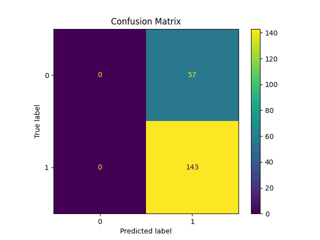
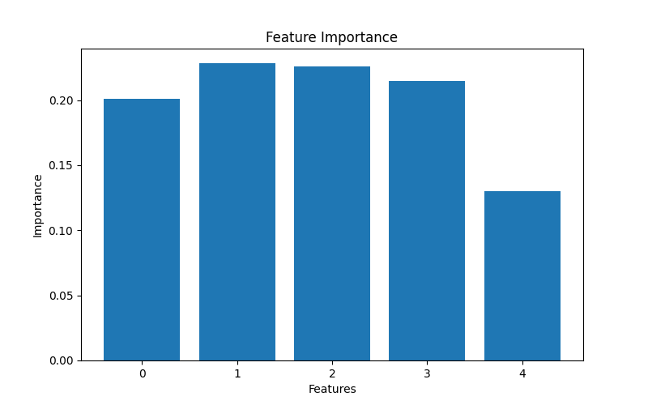

Hi, I'm Shibom Das

Data Analyst | Financial Analyst | Interest in ML

I build data-driven financial models for:

    Credit Risk Analysis
    Fraud Detection
    Portfolio Optimization

Key Projects:

    Credit Risk Model (85% accuracy)
    Fraud Detection System
    Portfolio Optimization (MPT)

Tech Stack: Python | SQL | Machine Learning | Finance

Connect: LinkedIn | Email

Credit Risk Prediction using Machine Learning

Overview

This project builds a machine learning model to predict whether a borrower is likely to default on a loan. It helps financial institutions make better lending decisions.

Problem

Loan defaults lead to major financial losses. Traditional methods fail to capture complex risk patterns.

Solution

Developed a classification model using ML algorithms to identify high-risk applicants.

Tech Stack

Python, Pandas, NumPy, Scikit-learn, Matplotlib

Workflow Data Cleaning Exploratory Data Analysis Feature Engineering Model Training (Logistic Regression, Random Forest) Evaluation Results Accuracy: ~85% Improved risk prediction Reduced false approvals Business Impact Helps banks reduce bad loans Enables automated loan approval systems
Model Comparison
Model 	Accuracy 	Precision 	Recall
Logistic Regression 	71.5% 	71.5% 	100%
Random Forest 	70.5% 	71.6% 	97.2%
Final Model Selection

Random Forest was selected due to its more balanced performance across precision and recall, avoiding overprediction seen in Logistic Regression.
## Results

